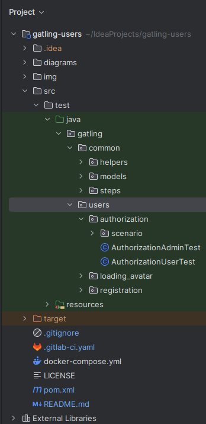
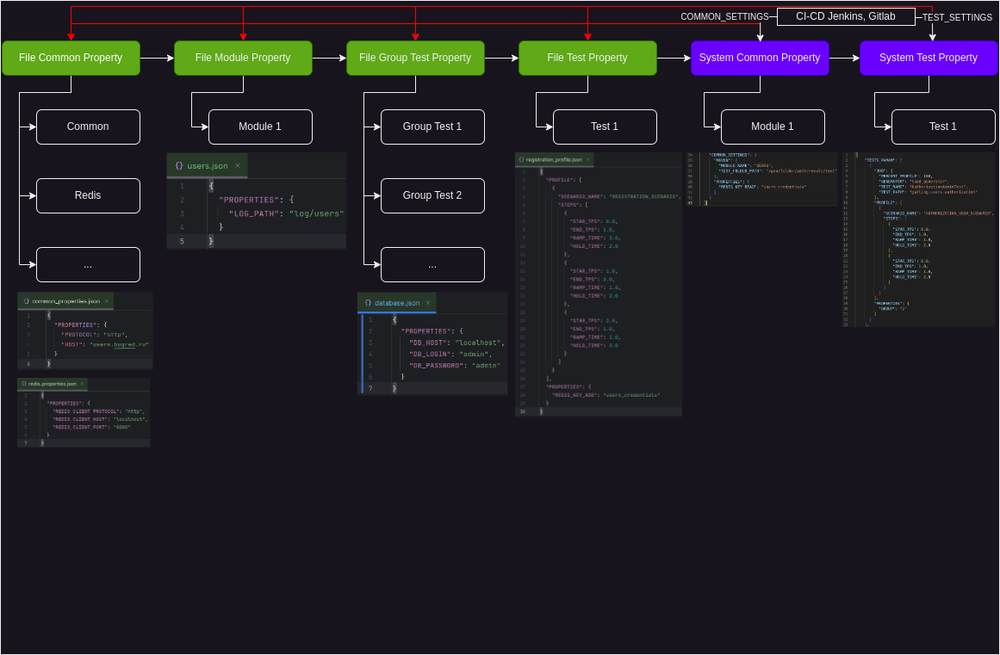
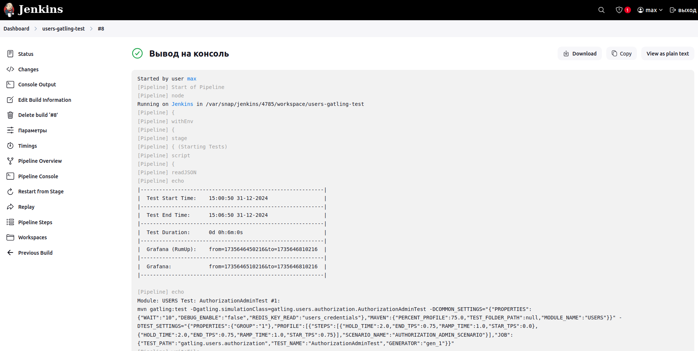
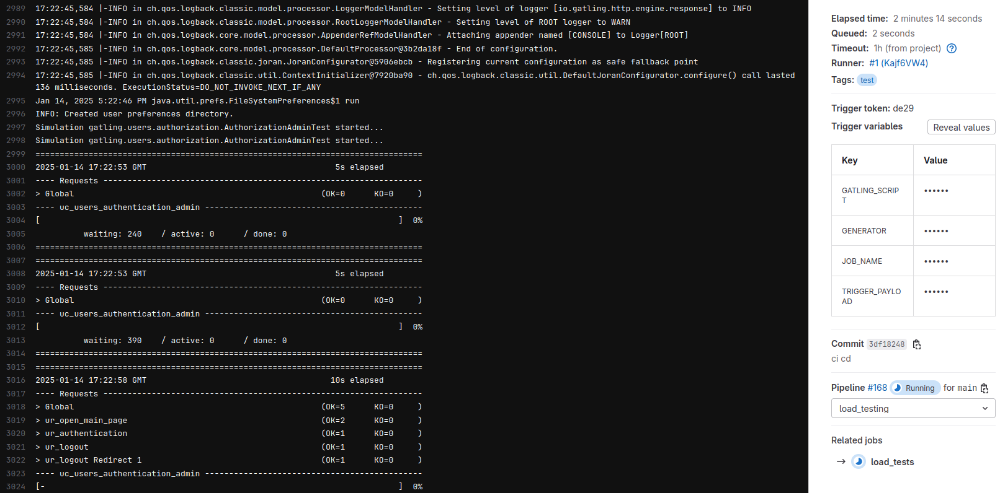
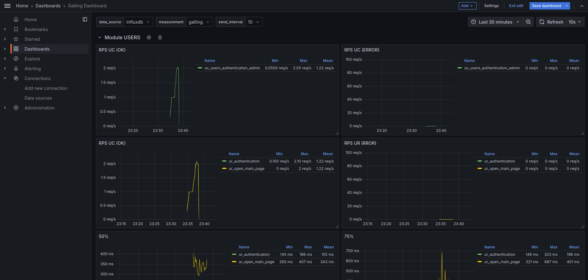

# gatling-users


Пример тестового фреймворка для быстрого старта на ([Gatling](https://docs.gatling.io/)).

## Структура каталогов



### Структура папки common

* **common** - Общие классы для тестов;
  * **groups** - Группа действий (UC - USER_CASE);
  * **helpers** - Вспомогательные классы;
  * **models** - PoJo классы для сериализации и десериализации;
  * **steps** - Общие шаги для тестов;

### Структура модуля

* **users** - Модуль;
  * **authorization** - Тестовый сценарий модуля users;
  * **loading_avatar** - Тестовый сценарий модуля users;
    * **groups** - Группа действий; 
    * **scenario** - Сценарии;
    * **steps** - Шаги в группе;
  * **registration** - Тестовый сценарий модуля users.

## Структура тестов

Пример тестового класса:

```java
public class AuthorizationAdminTest extends Simulation {
  public AuthorizationAdminTest() {
    //Загрузка Properties
    Map<String, Object> property = PropertyHelper.readProperties(
            "common/common_properties.json",
            "common/redis_properties.json",
            "tests/users/authorization/authorization_admin_property.json"
    );
    
    // Нагрузочный профиль
    HashMap<String, OpenInjectionStep[]> profile = PropertyHelper.getProfile(
            "tests/users/authorization/authorization_admin_profile.json"
    );

    // Настройки протокола
    HttpProtocolBuilder httpProtocol = HttpDsl.http
            .baseUrl(property.get("PROTOCOL") + "://" + property.get("HOST"))
            .disableCaching()
            .userAgentHeader("Gatling/Performance Test");
    
    this.setUp(
            // Тестовый сценарий
            AuthorizationScenario.authorizationAdminScenario(property)
                    // Профиль нагрузки
                    .injectOpen(profile.get("AUTHORIZATION_ADMIN_SCENARIO"))
    ).protocols(httpProtocol);
  }
}
```

## Работа с Properties в проекте

Подробнее с диаграммой можно ознакомиться **./diagrams/property.drawio**.



Пример использования в коде:

```java
Map<String, Object> property = PropertyHelper.readProperties(
        "common/common_properties.json", // Common Property
        "common/redis_properties.json", // Common Property Redis
        "tests/users/authorization/authorization_user_property.json" // Test Property
);

HashMap<String, OpenInjectionStep[]> profile = PropertyHelper.getProfile(
        "tests/users/registration/authorization_user_profile.json"
); // Нагрузочный профиль
```

## Правила именования

### Наименование переменных:

* Для имен переменных Java использовать **lowerCamelCase**;
* Для названия классов Java использовать **UpperCamelCase**;
* Аббревиатуры также писать CamelCase, например **SqlSelect**, а не **SQLSelect**;
* Для названия каталогов и файлов ресурсов использовать **lower_snake_case**;
* Для имен переменных (**session vars** - локальные переменные) использовать **lower_snake_case**;
* Для имен переменных (**session properties** - переменные из системы) использовать **UPPER_SNAKE_CASE**.

### Наименование сценариев и шагов:

* Использовать **lower_snake_case**;
* Названия сценария начинать с **uc_<user_case>**;
* Названия HTTP шагов начинать с **ur_<user_request>**;
* Названия запросов к Database или Redis начинать с **db_<database>**;
* Для сообщений лога использовать английский язык. Пример формата - **«Message Something Data»**.

## Запуск тестов через CLI

Пример команды запуска:

### Запуск через maven

Команда для запуска теста через maven:

```bash
mvn gatling:test -Dgatling.simulationClass=gatling.users.authorization.AuthorizationAdminTest
```

### Запуск через jar

Команда для сборки jar архива перед запуском теста:

```bash
mvn clean package
```

Запуск теста через jar:

```bash
java -Xms1g -Xmx2g -Dakka.actor.default-dispatcher.fork-join-executor.parallelism-max=10 -cp target/performance-test-gatling.jar io.gatling.app.Gatling -s gatling.users.authorization.AuthorizationAdminTest
```

## Запуск тестов через Jenkins

Для запуска нагрузочных тестов используется Json.



Пример Json профиля нагрузки:

```json
{
  "TESTS_PARAM": [
    {
      "JOB": {
        "JVM_ARGS": "-Xms1g -Xmx2g",
        "PARALLELISM_MAX": 10,
        "GENERATOR": "load_generator",
        "TEST_NAME": "AuthorizationAdminTest",
        "TEST_PATH": "gatling.users.authorization"
      },
      "PROFILE": [
        {
          "SCENARIO_NAME": "AUTHORIZATION_USER_SCENARIO",
          "STEPS": [
            {
              "STAR_TPS": 0.0,
              "END_TPS": 1.0,
              "RAMP_TIME": 1.0,
              "HOLD_TIME": 2.0
            },
            {
              "STAR_TPS": 0.0,
              "END_TPS": 1.0,
              "RAMP_TIME": 1.0,
              "HOLD_TIME": 2.0
            }
          ]
        }
      ],
      "PROPERTIES": {
        "GROUP": "2"
      }
    }
  ],
  "COMMON_SETTINGS": {
    "MAVEN": {
      "MODULE_NAME": "USERS",
      "PERCENT_PROFILE": 100.0
    },
    "PROPERTIES": {
      "DEBUG_ENABLE": "true",
      "REDIS_KEY_READ": "users_credentials"
    }
  }
}
```

Описание параметров:
"JVM_ARGS": "-Xms1g -Xmx2g",

* **TESTS_PARAM** - Параметры тестов;
  * **JOB** - Параметры для Java машины;
    * **JVM_ARGS** - Ограничение по ОЗУ;
    * **PARALLELISM_MAX** - Ограничение максимального количества потоков;
    * **GENERATOR** - Где будет запускаться тесты;
    * **TEST_NAME** - Наименования тестового класса;
    * **TEST_FOLDER** - Путь до класса в проекте;
  * **PROFILE** - Параметры профиля нагрузки;
    * **Array profile** - Массив профилей для разных катушек;
      * **SCENARIO_NAME** - Наименование катушки;
      * **STEPS** - Шаги профиля: **STAR_TPS** - подаваемая нагрузка (с какого значения начинаем), **END_TPS** - подаваемая нагрузка (на какое значение выходим), **RAMP_TIME** - выход на заданную интенсивность (мин) и **HOLD_TIME** - удержание нагрузки (мин);
  * **PROPERTIES** - Дополнительные параметры для теста.


* **COMMON_SETTINGS** - Параметры для всех тестов;
  * **MAVEN** - Параметры для bash скрипта;
    * **MODULE_NAME** - Название модуля (используется для сбора логов);
    * **PERCENT_PROFILE** - Процент от профиля;
  * **PROPERTIES** - Дополнительные общие параметры для всех тестов.

## Запуск тестов через Gitlab



Для запуска нагрузочных тестов используется Json.

Пример Json профиля нагрузки:

```json
{
  "TESTS_PARAM": [
    {
      "JOB": {
        "GENERATOR": "test",
        "TEST_NAME": "AuthorizationAdminTest",
        "TEST_PATH": "gatling.users.authorization"
      },
      "PROFILE": [
        {
          "SCENARIO_NAME": "AUTHORIZATION_ADMIN_SCENARIO",
          "STEPS": [
            {
              "STAR_TPS": 0.0,
              "END_TPS": 1.0,
              "RAMP_TIME": 0.5,
              "HOLD_TIME": 1.0
            },
            {
              "STAR_TPS": 1.0,
              "END_TPS": 1.5,
              "RAMP_TIME": 1.0,
              "HOLD_TIME": 1.0
            }
          ]
        }
      ],
      "PROPERTIES": {
        "GROUP": "2"
      }
    }
  ],
  "COMMON_SETTINGS": {
    "MAVEN": {
      "MODULE_NAME": "USERS",
      "PERCENT_PROFILE": 100.0
    },
    "PROPERTIES": {
      "DEBUG_ENABLE": "false",
      "REDIS_KEY_READ": "users_credentials"
    }
  }
}
```

Описание параметров:

* **TESTS_PARAM** - Параметры тестов;
  * **JOB** - Параметры для Java машины;
    * **GENERATOR** - Где будут запускаться тесты;
    * **TEST_NAME** - Наименования тестового класса;
    * **TEST_FOLDER** - Путь до класса в проекте;
  * **PROFILE** - Параметры профиля нагрузки;
    * **Array profile** - Массив профилей для разных катушек;
      * **SCENARIO_NAME** - Наименование катушки;
      * **STEPS** - Шаги профиля: **STAR_TPS** - подаваемая нагрузка (с какого значения начинаем), **END_TPS** - подаваемая нагрузка (на какое значение выходим), **RAMP_TIME** - выход на заданную интенсивность (мин) и **HOLD_TIME** - удержание нагрузки (мин);
  * **PROPERTIES** - Дополнительные параметры для теста.


* **COMMON_SETTINGS** - Параметры для все тестов;
  * **MAVEN** - Параметры для bash скрипта;
    * **MODULE_NAME** - Название модуля (используется для сбора логов);
    * **PERCENT_PROFILE** - Процент от профиля;
  * **PROPERTIES** - Дополнительные общие параметры для всех тестов.


### Запуск тестов через Python + Gitlab

Путь к скрипту **./scripts/main.py**

Параметры скрипта:

В качестве параметров скрипт принимает массив путей к профилям нагрузки **(1 профиль == 1 модуль)**.

Пример параметра **./scripts/resources/profiles/users/users_profile.json**.

Пример команды для запуска python скрипта:

```python
python3 ./scripts/main.py ./scripts/resources/profiles/users/users_profile.json
```

Результат запуска:

```
|-----------------------------------|
| Название модуля: 'USERS'          |
|-----------------------------------|
| Генератор нагрузки: 'test'        |
|-----------------------------------|
| Job 'load_tests' успешно запущена |
|-----------------------------------|
```

## Мониторинг Grafana + InfluxDB + Graphite

Путь шаблона для Grafana: **./monitoring/Gatling Dashboard.json**.



Перед первым запуском теста нужно развернуть influxDB и создать базу **gatlingdb**.

```bash
sudo docker compose up
```

С шаблоном отправки метрик в InfluxDB можно ознакомится в файле конфигурации **./monitoring/influxdb/influxdb.conf**.

Пример шаблона:

```text
[[graphite]]
        enabled = true
        database = "gatlingdb"

        templates = [
                "gatling.*.*.*.* measurement.simulation.group.request.status.field"
        ]
```

**Что нужно добавить в демо проект:**

1. **Добавить таблицу по запросам (Название транзакции, количество запросов, процент успешных запрос, процент ошибочных запросов);**
2. В python скрипте выводить время теста (как в jenkins job);
3. Записывать логи запуска python скрипта в файл;
4. Попробовать Redis (не через rust-redis-client);
