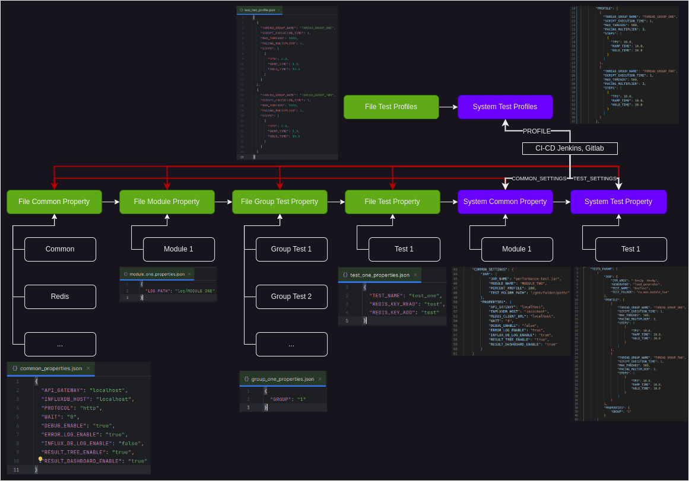

# gatling-users


Пример тестового фреймворка для быстрого старта на ([Gatling](https://docs.gatling.io/)).

1. [Список систем](#список-систем);
2. [Структура каталогов](#структура-каталогов);
   - 2.1 [Структура папок common](#структура-папки-common);
   - 2.2 [Структура модуля](#структура-модуля);
3. [Структура тестов](#структура-тестов);
4. [Работа с properties в проекте](#работа-с-properties-в-проекте);
5. [Правила оформления кода в проекте](#правила-оформления-кода-в-проекте);
   - 5.1 [Структура проекта](#структура-проекта);
   - 5.2 [Наименование переменных](#наименование-переменных);
   - 5.3 [Наименование scenario, steps и groups](#наименование-scenario-steps-и-groups);
6. [Профиль нагрузки](#профиль-нагрузки);
7. [Редактор профиля](#редактор-профиля);
8. [Запуск тестов](#запуск-тестов);
9. [Проверка тестов перед запуском](#проверка-тестов-перед-запуском);
10. [Мониторинг](#мониторинг);
11. [Сбор отчёта](#сбор-отчёта);
12. [Вспомогательные классы для работы c redis](#вспомогательные-классы-для-работы-с-redis);
    - 12.1 [Получить информации о Redis и Key](#получить-информацию-о-Redis-и-Keys);
    - 12.2 [Проверка количества данных в Redis](#проверка-количества-данных-Redis);
    - 12.3 [Добавить данные в Redis (List)](#добавить-данные-в-Redis-(List));
    - 12.4 [Прочитать данные из Redis (List)](#прочитать-данные-из-Redis-(Redis));
    - 12.5 [Скачать дамп по ключю](#скачать-дамп-по-ключю);
    - 12.6 [Загрузить дамп в Redis](#загрузить-дамп-в-Redis);
    - 12.7 [Удалить ключи по паттерну](#удалить-ключи-по-паттерну);
    - 12.8 [Удалить все ключи из Redis](#удалить-все-ключи-из-Redis);
13. [Вспомогательные классы](#вспомогательные-классы);
    - 13.1 [Автоматическая генерация профиля для прегенерации данных](#автоматическая-генерация-профиля-для-прегенерации-данных);
    - 13.2 [Изменение шагов в профиль](#изменение-шагов-в-профиле).

## Список систем

* [Users](./docks/system_users.md).

## Структура каталогов


### Структура проекта

* **debug_tests** - TestCase для проверки тестов;
* **diagrams** - Вспомогательные диаграммы, взаимодействия тестов (draw.io);
* **docks** - Документация систем (users, ...);
* **env** - Secretes для postgres, kafka, redis, ...
* **img** - Картинки для документации;
* **java** - Папка с тестами;
* **monitoring** - Настройки для InfluxDB и дашборды для Grafana;
* **profiles** - Профели нагрузки;
* **resources** - Ресурсы для тестов;
* **scripts** - Вспомогательные скрипты (запуск, тестов, ...);
* **sql** - Запросы SQL для подготовки данных или подготовки базы перед тестом;
* **src** - Вспомогательные классы;
* **ssl_kafka** - Kafka сертификаты;
* **target** - Результаты сборки проекта;
* **.gitignore** - Файлы которые игнорируем;
* **jar-with-dependencies.xml** - Параметры для сборки .jar файла;
* **pom.xml** - Файл с зависимостями для проекта;
* **README.md** - Документация проекта.

### Структура папки common

* **common** - Общие классы для тестов;
  * **groups** - Группа действий (UC - USER_CASE);
  * **helpers** - Вспомогательные классы;
  * **models** - PoJo классы для сериализации и десериализации;
  * **scenario** - Общие сценарии для тестов (scenario);
  * **steps** - Общие шаги для тестов;

### Структура модуля

* **pre_gen_data** - Классы для подготовки данных перед тестом;
* **users** - Название системы;
  * **common** - Название системы;
    * **authorization** - Тестовый сценарий модуля users;
      * **groups** - Группа действий;
      * **helpers** - Вспомогательные классы модуля;
      * **scenario** - Сценарии;
      * **steps** - Шаги в группе;
      * **AuthorizationAdminTest** - Тест 1;
      * **AuthorizationUserTest** - Тест 2;
    * **registration** - Тестовый сценарий модуля users.

## Структура тестов

Пример тестового класса:

```java
public class AuthorizationAdminTest extends Simulation {
  public AuthorizationAdminTest() {
    //Загрузка Properties
    Map<String, Object> property = PropertyHelper.readProperties(
            "common/common_properties.json",
            "common/redis_properties.json",
            "tests/users/authorization/authorization_admin_property.json"
    );
    
    // Нагрузочный профиль
    HashMap<String, OpenInjectionStep[]> profile = PropertyHelper.getProfile(
            "tests/users/authorization/authorization_admin_profile.json"
    );

    // Настройки протокола
    HttpProtocolBuilder httpProtocol = HttpDsl.http
            .baseUrl(property.get("PROTOCOL") + "://" + property.get("HOST"))
            .disableCaching()
            .userAgentHeader("Gatling/Performance Test");
    
    this.setUp(
            // Тестовый сценарий
            AuthorizationScenario.authorizationAdminScenario(property)
                    // Профиль нагрузки
                    .injectOpen(profile.get("AUTHORIZATION_ADMIN_SCENARIO"))
    ).protocols(httpProtocol);
  }
}
```

## Работа с Properties в проекте

Подробнее с диаграммой можно ознакомиться **./diagrams/property.drawio**.



Пример использования в коде:

```java
Map<String, Object> property = PropertyHelper.readProperties(
        "common/common_properties.json", // Common Property
        "common/redis_properties.json", // Common Property Redis
        "tests/users/authorization/authorization_user_property.json" // Test Property
);

HashMap<String, OpenInjectionStep[]> profile = PropertyHelper.getProfile(
        "tests/users/registration/authorization_user_profile.json"
); // Нагрузочный профиль
```

## Правила именования

### Наименование переменных:

* Для имен переменных Java использовать **lowerCamelCase**;
* Для названия классов Java использовать **UpperCamelCase**;
* Аббревиатуры также писать CamelCase, например **SqlSelect**, а не **SQLSelect**;
* Для названия каталогов и файлов ресурсов использовать **lower_snake_case**;
* Для имен переменных (**session vars** - локальные переменные) использовать **lower_snake_case**;
* Для имен переменных (**session properties** - переменные из системы) использовать **UPPER_SNAKE_CASE**.

### Наименование сценариев и шагов:

* Использовать **lower_snake_case**;
* Названия сценария (scenario) **`<system_name>_<script_code (1)>_<operation_name (kafka, rest, ...)>_<scenario_name, endpoint>_senario`**;
* Названия групп (groups) **`ur_<system_name>_<script_code (1)>_<operation_name (kafka, rest, ...)>_<group_name, endpoint - (если в группе одна операция)>`**;
* Название шагов (steps) **`ur_<system_name>_<script_code (1.1)>_<operation_name (kaffka, rest, ...)>_<operation_type (get, post, delete, send, ...)>_<step_name, endpoint>`**
* Названия запросов к Database или Redis начинать с **`db_<system_name>_<script_code>_<database_host>_<table_name, key_name>`**;
* Для сообщений лога использовать английский язык. Пример формата - **«Message Something Data»**.

## Профиль нагрузки

Профиль нагрузки хранить в папке **`./profiles/<system_code>/`**.

Пример JSON профиля:

```json

```

Пример JSON профиля для редактора профиля (Тоже может использоваться для запуска тестов):

**ЯВЛЯЕТСЯ ОСНОВНЫМ ФОРМАТОМ!**

```json

```

Описание параметров:
"JVM_ARGS": "-Xms1g -Xmx2g",

* **TESTS_PARAM** - Параметры тестов;
    * **JOB** - Параметры для Java машины;
        * **JVM_ARGS** - Ограничение по ОЗУ;
        * **PARALLELISM_MAX** - Ограничение максимального количества потоков;
        * **GENERATOR** - Где будет запускаться тесты;
        * **TEST_NAME** - Наименования тестового класса;
        * **TEST_FOLDER** - Путь до класса в проекте;
    * **PROFILE** - Параметры профиля нагрузки;
        * **Array profile** - Массив профилей для разных катушек;
            * **SCENARIO_NAME** - Наименование катушки;
            * **STEPS** - Шаги профиля: **STAR_TPS** - подаваемая нагрузка (с какого значения начинаем), **END_TPS** - подаваемая нагрузка (на какое значение выходим), **RAMP_TIME** - выход на заданную интенсивность (мин) и **HOLD_TIME** - удержание нагрузки (мин);
    * **PROPERTIES** - Дополнительные параметры для теста.


* **COMMON_SETTINGS** - Параметры для всех тестов;
    * **MAVEN** - Параметры для bash скрипта;
        * **MODULE_NAME** - Название модуля (используется для сбора логов);
        * **PERCENT_PROFILE** - Процент от профиля;
    * **PROPERTIES** - Дополнительные общие параметры для всех тестов.

## Запуск тестов через CLI

Пример команды запуска:

### Запуск через maven

Команда для запуска теста через maven:

```bash
mvn -DGRAPHITE_HOST=localhost -DGRAPHITE_PORT=2003 -DLOAD_GENERATOR=localhost gatling:test -Dgatling.simulationClass=gatling.TestRunner
```

### Запуск через jar

Команда для сборки jar архива перед запуском теста:

```bash
mvn clean package -DskipTests
```

Запуск теста через jar:

```bash
java -Xms1g -Xmx2g -Dakka.actor.default-dispatcher.fork-join-executor.parallelism-max=10 -cp target/performance-test-gatling.jar io.gatling.app.Gatling -s gatling.users.authorization.AuthorizationAdminTest
```

```bash
USE gatlingdb
DROP MEASUREMENT gatling
```

## Запуск тестов через Jenkins

Настройка Jenkins Agents

```bash
curl -sO http://localhost:8080/jnlpJars/agent.jar;
java -jar agent.jar -url http://localhost:8080/ -secret 123 -name test -webSocket -workDir "/home/jenkins/agent"
```

Для запуска нагрузочных тестов используется Json.


Пример Json профиля нагрузки:

```json

```

## Запуск тестов через Gitlab


Для запуска нагрузочных тестов используется Json.

Пример Json профиля нагрузки:

```json

```


### Запуск тестов через Python + Gitlab

Путь к скрипту **./scripts/main.py**

Параметры скрипта:

В качестве параметров скрипт принимает массив путей к профилям нагрузки **(1 профиль == 1 модуль)**.

Пример параметра **./scripts/resources/profiles/users/users_profile.json**.

Пример команды для запуска python скрипта:

```python
python3 ./scripts/main.py ./scripts/resources/profiles/users/users_profile.json
```

Результат запуска:

```
|-----------------------------------|
| Название модуля: 'USERS'          |
|-----------------------------------|
| Генератор нагрузки: 'test'        |
|-----------------------------------|
| Job 'load_tests' успешно запущена |
|-----------------------------------|
```

## Мониторинг Grafana + InfluxDB + Graphite

Путь шаблона для Grafana: **./monitoring/Gatling Dashboard.json**.


Перед первым запуском теста нужно развернуть influxDB и создать базу **gatlingdb**.

```bash
sudo docker compose up
```

С шаблоном отправки метрик в InfluxDB можно ознакомится в файле конфигурации **./monitoring/influxdb/influxdb.conf**.

Пример шаблона:

```text
[[graphite]]
        enabled = true
        database = "gatlingdb"

templates = [
        "gatling.*.*.users.*.* measurement.loadGenerator.simulation.measurement.scenario.field",
        "gatling.*.*.allRequests.*.* measurement.loadGenerator.simulation.measurement.status.field",
        "gatling.*.*.*.*.*.* measurement.loadGenerator.simulation.group.request.status.field"
]
```

### Вспомогательные классы

**Что нужно добавить в демо проект:**

1. **Добавить таблицу по запросам (Название транзакции, количество запросов, процент успешных запрос, процент ошибочных запросов);**
2. В python скрипте выводить время теста (как в jenkins job);
3. Записывать логи запуска python скрипта в файл;
4. Попробовать Redis (не через rust-redis-client).